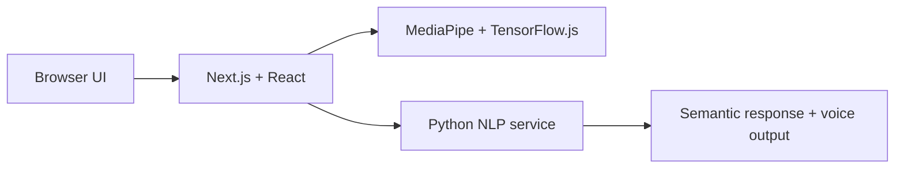

# 🧠 AI-Driven Interactive Portfolio  

[](./LICENSE)

> 🚀 *A next-generation portfolio that doesn’t just show your skills — it **demonstrates** them using real AI.*  

---

## 🌟 Overview  

Welcome to my **AI-Driven Interactive Portfolio**, a 3-part journey that fuses **Web Development**, **Computer Vision**, and **Natural Language Processing** into one immersive experience.  

This project explores how portfolios can evolve from static websites into **interactive AI-powered experiences**.  

---

## 🎬 Project Series  

### 🧩 Part 1 – Web Development & Design  

Beautifully crafted with **Next.js**, **TypeScript**, and **Aceternity UI** for fluid animations and responsive layouts.  

💡 *In this phase, I focused on building the foundation: dynamic design, performance, and a glimpse of AI integration to come.*  

🔹 **Highlights**  
- Responsive design with **Aceternity UI**  
- Animated transitions and smooth interactivity  
- Modern component-based architecture  
- Built-in hooks for future AI expansion  

🎥 **Demo Video – Web Dev & Design**  

https://github.com/user-attachments/assets/9e2b8b95-c876-4b46-bce2-ec0e4512e0ac


---

### 👁️ Part 2 – Computer Vision Navigation  

Hands-free control powered by **TensorFlow.js** and **MediaPipe**!  
Use gestures to navigate between pages and sections — no clicks required.  

<details>
<summary>🧠 How It Works (Click to Expand)</summary>

- Real-time camera input processed with **MediaPipe Hands**  
- Gesture detection (swipes, clicks, direction) via **TensorFlow.js**  
- Integrated into React for fluid section transitions  
- Future-ready for AR/VR extensions  

</details>

🎥 **Demo Video – Computer Vision Navigation**  

https://github.com/user-attachments/assets/a477904c-0fef-4f0e-9825-44cc158ce648

---

### 🗣️ Part 3 – NLP & AI Avatar (Finale)  

A fully interactive **NLP-powered chatbot + avatar** that understands, summarizes, and *talks back*.  

This stage transforms the portfolio into a **conversational assistant** that responds intelligently and speaks using text-to-speech.  

<details>
<summary>🧠 How It Works (Click to Expand)</summary>

- **Text Preprocessing:** Tokenization, stopword removal, lemmatization  
- **NER & POS Tagging:** Extracts entities using **spaCy**  
- **Word Embeddings (SBERT):** Transforms text into semantic vectors  
- **Cosine Similarity:** Matches queries with stored answers  
- **Summarization Board:** Condenses CV into key highlights  
- **Voice Integration:** Speech-to-text + text-to-speech for hands-free chat  
- **AI Avatar:** Digital version of me that responds verbally to user questions  

</details>

🎥 **Demo Video – NLP & Avatar Interaction**  

https://github.com/user-attachments/assets/5b2456c6-d6b0-4a0d-95e9-eff031c72152


---

## ⚙️ Tech Stack  

| Category | Technologies |
|-----------|--------------|
| **Frontend** | Next.js, TypeScript, React, Aceternity UI |
| **NLP/AI** | spaCy, SBERT, Cosine Similarity, Text Summarization APIs |
| **Computer Vision** | TensorFlow.js, MediaPipe |
| **Voice Processing** | Web Speech API (STT + TTS) |
| **Deployment** | Vercel |

---

## ✨ Features  

✅ Responsive, animated UI  
✋ Gesture-based navigation  
🧠 NLP chatbot + voice assistant  
📄 CV summarization board  
🗣️ AI avatar with speech output  
🎨 Futuristic UI powered by Aceternity components  

---

## 🧱 Engineering Architecture

The project is organized around a browser-based Next.js experience with two interactive AI paths:



- The frontend owns the responsive interface, navigation, gesture events, and user interaction.
- Computer-vision inference runs in the browser through MediaPipe and TensorFlow.js.
- NLP processing is exposed through the Python service started with Uvicorn.
- The UI combines returned semantic results with browser speech APIs for conversational interaction.

## ⚖️ Engineering Decisions and Trade-offs

- **MediaPipe + TensorFlow.js:** keeps gesture processing close to the browser and avoids sending camera frames to a remote service, at the cost of client-device performance differences.
- **SBERT + cosine similarity:** provides semantic matching beyond exact keywords, while requiring a larger model/runtime than simple keyword rules.
- **Web Speech API:** enables voice interaction without a separate speech backend, but browser support and voice quality vary by platform.
- **Interactive AI features:** make the portfolio demonstrable, but camera and microphone permissions must be granted for the related experiences.

## 🚀 Deployment

The frontend is designed for deployment on Vercel. The NLP component runs as a separate Python/Uvicorn service and must be reachable by the frontend configuration. Camera and microphone features require a secure browser context such as HTTPS.

## ⚠️ Limitations

- Gesture recognition depends on lighting, camera quality, and client hardware.
- Browser speech recognition and synthesis are not equally supported across browsers.
- SBERT similarity is approximate and depends on the supplied knowledge/content.
- The project is a portfolio demonstration, not a general-purpose conversational AI system.

## 🧠 Goal  

To push the boundaries of what a personal portfolio can be — from a static showcase to a **living, intelligent interface** that reflects both creativity and technical depth.  

---

## 🛠️ Setup & Run

The project uses a frontend and a separate Python NLP service. Run them in separate terminals.

### Frontend

```bash
git clone https://github.com/Nardy11/AI-Interactive-Portfolio.git
cd AI-Interactive-Portfolio
npm install
npm run dev
```

### NLP service

From the service directory/configured Python entry point:

```bash
pip install -r requirements.txt
python -m spacy download en_core_web_md
uvicorn main:main_app --host 0.0.0.0 --port 8000
```

The exact service path and environment configuration should match the repository’s current source layout.

## License

MIT — see [LICENSE](./LICENSE).

